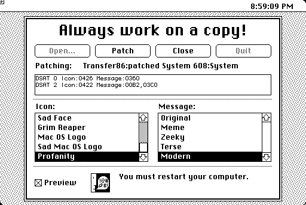
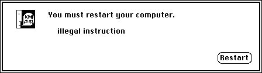
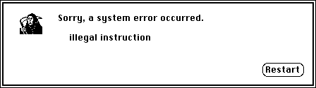
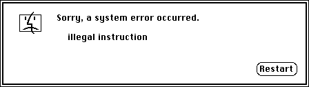
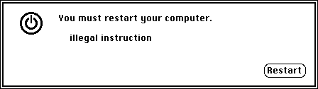
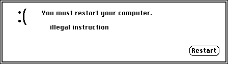
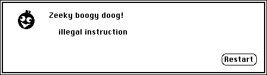
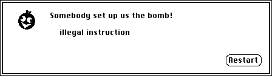

# BombPatcher
An application to do something I've always wanted to do: patch the System file to customize the Mac OS Classic "Sorry, a system error occurred" bomb dialog.

 *  **Always make a backup copy of the file you are patching.** We will not be held responsible if something goes wrong.
 *  **Do not patch the active System file.** If possible, use a different startup disk to do the patching, and patch a copy instead.
 *  There is a chance of "de-blessing" the System Folder. If this happens, make another copy of the original System file and try patching again.
 *  For System 7 and later, you may have to patch the System Enabler as well as the System file. The same warnings and caveats apply!

Version 1.1 (in the v1 folder) was created with HyperCard and tested on System 6.0.8 under Mini vMac and Mac OS 9.0.4 under SheepShaver. The standalone application is 1849K and the stack is 117K.

Version 2.0 (in the src and build folders) is written in C, compiled with [Retro68](https://github.com/autc04/Retro68), and tested on System 4.1 under Mini vMac, System 6.0.8 under Mini vMac, and Mac OS 9.0.4 under SheepShaver. The compiled application is 17K.

